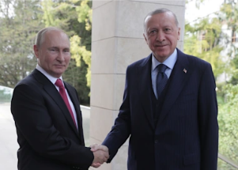

## Putin's 'deeply offensive' demands for ending the war

Turkish President Recep Tayyip Erdogan has been in contact with Russian and Ukrainian officials throughout the invasion, according to Ibrahim Kalin, an adviser to Erdogan.

[He listened in on the call with Putin »](https://www.yahoo.com/news/putin-shared-turkeys-president-demands-020452059.html)
