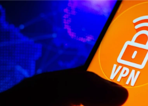

## Some Russians bypassing Putin's 'digital iron curtain'

Vladimir Putin's campaign to tighten his grip on Russia's once-open information ecosystem intensified in 2019, when the country's "sovereign Internet" law came into force.

[Drastic 'divide' has emerged »](https://www.yahoo.com/news/russians-breaking-putins-digital-iron-123903981.html)
