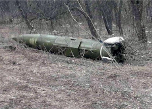

## Sign Russia may be short on weapons in invasion

Russia’s military has claimed to have twice unleashed hypersonic missiles in its invasion of Ukraine, purportedly destroying an arms depot in the process, during its monthlong onslaught.

[Believed to have been used in Syria »](https://www.yahoo.com/news/what-are-hypersonic-missiles-russias-newest-weapon-in-ukraine-war-174751874.html)
