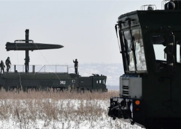

## 'We have to consider that this is becoming a possibility'

Both Russia and the U.S. have nukes that are less destructive, their power just fractions of the Hiroshima bomb's force, their use perhaps less frightening and more thinkable.

['The chances are low but rising' »](https://www.yahoo.com/news/smaller-bombs-could-turn-ukraine-114147827.html)
