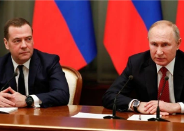

## Russia warns U.S. of 'big nuclear explosion' in threat

Dmitry Medvedev, deputy secretary of Russia's security council, said the U.S. had conspired to destroy Russia as part of a "primitive game" since the 1991 fall of the Soviet Union.

[He says it's not crazy to think »](https://www.yahoo.com/news/putin-ally-says-united-states-075006672.html)
