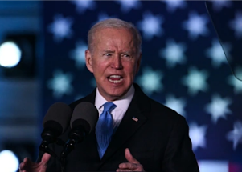

## Analysts weigh in on Biden's remark about Putin

The president said in Warsaw that Vladimir Putin "cannot remain in power." Some analysts saw the remark as a setback, others said it merely confirms Putin's suspicions.

['When Biden ad libs, there is trouble' »](https://www.yahoo.com/news/gaffe-escalation-biden-stirs-concern-013458740.html)
