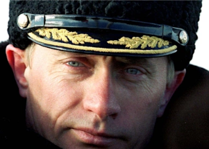

## 'He hated what happened to Russia': Understanding Putin

As China rose, as the U.S. fought and lost its forever wars in Iraq and Afghanistan, as technology networked the world, a Russian enigma took form in the Kremlin.

[His initial priorities »](https://www.yahoo.com/news/making-vladimir-putin-144553109.html)
