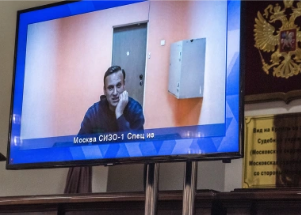

## Tech company pulls out of Russia, leaves behind spy tool

The Finnish company Nokia played a key role in enabling Russia's digital spying system, documents show, raising questions of corporate responsibility.

['Unlimited access to all communication' »](https://www.yahoo.com/news/nokia-pulled-russia-vast-surveillance-182920313.html)
