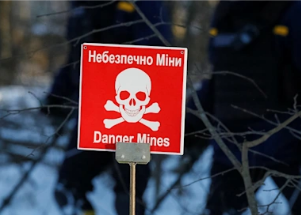

## Troops disturbed radioactive dust in 'suicidal' move

Russian soldiers who seized the site of the Chernobyl nuclear disaster drove their armored vehicles without radiation protection through a highly toxic zone called the "Red Forest."

[Details emerge after last month's seizure »](https://www.yahoo.com/news/unprotected-russian-soldiers-disturbed-radioactive-165419388.html)
