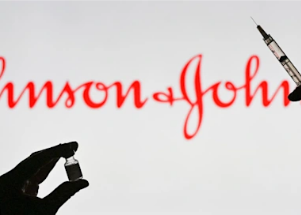

## CDC issues new guidance for Americans who got J&J shot

The nearly 17 million Americans who got the Johnson & Johnson coronavirus vaccine aren't as protected as those who received Pfizer-BioNTech and Moderna shots, data shows.

[The most effective vaccine combos  »](https://www.yahoo.com/news/got-j-j-vaccine-consider-175612131.html)
