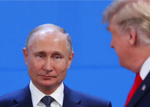

## Trump attempts to clarify his praise for Putin

Just two days before the Russian invasion, Donald Trump called Vladimir Putin's strategy "genius" and "savvy." Now the former president is seeking to explain that assessment.

['Unfortunate decision to enter Ukraine' »](https://www.yahoo.com/news/trump-denies-calling-putin-a-genius-214302904.html)
