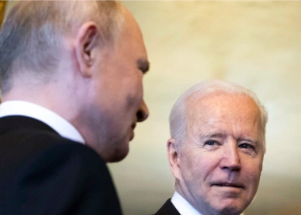

## U.S. move pushes Russia toward default choice

The United States stopped the Russian government from paying holders of its sovereign debt more than $600 million from reserves held at U.S. banks.

['Russia must choose' »](https://www.yahoo.com/finance/news/u-cracks-down-russian-debt-013707124.html)
