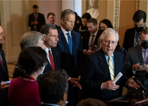

## All 50 Republican senators block COVID bill movement

Republicans blocked a Democratic attempt to begin Senate debate on a $10 billion COVID-19 compromise, pressing to entangle it with a showdown over immigration restrictions.

[At least 10 GOP votes will be needed »](https://www.yahoo.com/news/gop-blocks-senate-covid-bill-041704072.html)
