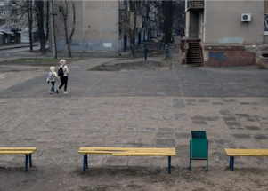

## 'They were sitting on the bench. They are dead now.'

Wars often inflict violence at random on unsuspecting civilians. Two people in Slobidskyi were killed as they sat on a park bench sharing a late lunch or maybe just feeding pigeons.

[‘Who is that? What is that?' »](https://www.yahoo.com/news/traces-lives-cut-short-bread-181551483.html)
