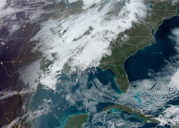

## Historic blizzard likely as storm threats persist

The multiday system is expected to affect a much larger population than the previous outbreaks, including in cities like St. Louis and Chicago, and will be harder to track.

[Storm risk for 13M people  »](https://www.yahoo.com/news/historic-blizzard-likely-severe-storms-161609105.html)
