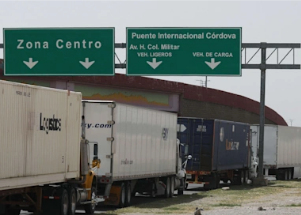

## Trucks come to a standstill at Texas-Mexico border

Texas Agriculture Commissioner Sid Miller slammed Gov. Gregg Abbott's border move, saying it's keeping food from store shelves and causing perishables to rot in trucks.

['The people of Texas deserve better!' »](https://www.yahoo.com/news/as-texas-buses-migrants-to-dc-abbott-faces-backlash-for-chaos-at-the-border-224343181.html)
