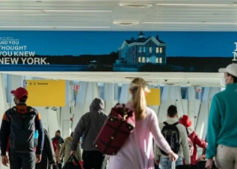

## Big changes coming to U.S. COVID travel advisories

The State Department currently has nearly 120 countries and territories listed as "Level Four: Do Not Travel" because of COVID. That's about to change.

[Follows CDC action »](https://www.yahoo.com/news/u-state-department-cut-back-140445662.html)
