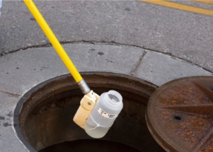

## The 1st clues appear in sewer water, and they're piling up

As the United States enters year three of the coronavirus pandemic, disease trackers are trying to stay one step ahead of the constantly evolving virus — by hunting for it in feces.

[A monitoring approach that's used today »](https://www.yahoo.com/news/where-covid-pandemic-headed-look-154906866.html)
