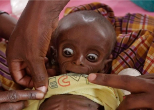

## Conflict half a world away has Somalia on brink of famine

After three years of almost no rain, the impoverished East African country is in the grips of its worst drought in decades. War in "Europe's breadbasket" is accelerating the crisis.

[Estimated 260,000 people perished in 2011 »](https://www.yahoo.com/news/climate-change-and-russias-war-in-ukraine-help-push-somalia-to-the-brink-of-famine-231159528.html)
