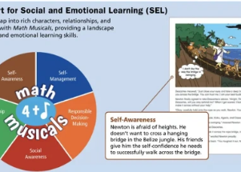

## What's inside dozens of math books rejected by Florida

Many included social-emotional learning content, a practice with roots in psychological research that tries to help students develop mindsets that can support academic success.

[21 of the rejected books reviewed »](https://www.yahoo.com/news/look-inside-textbooks-florida-rejected-115847845.html)
