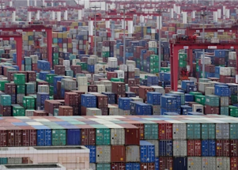

## 'Everything is halted': Shutdowns worsen shortages

Widespread COVID outbreaks in China have brought entire cities to a standstill and hobbled manufacturing and shipping hubs throughout the country.

[Weighing on stock markets globally »](https://www.yahoo.com/news/everything-halted-shanghai-shutdowns-worsening-103816660.html)
