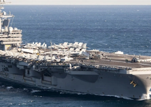

## Suicides raise alarm: 'Half the boat is not livable'

Sailors aboard the USS George Washington, where five other crew members committed suicide, said their struggles were related to nearly uninhabitable living conditions.

['They really, really failed her' »](https://www.yahoo.com/news/uss-george-washington-sailors-detail-201114693.html)
