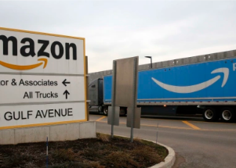

## Amazon pulls key benefit for U.S. workers

Employees will no longer receive paid time off while they're recovering from COVID-19, Amazon announced, as the company continues its shift back to a pre-pandemic footing.

['We can continue to safely adjust' »](https://www.yahoo.com/finance/news/amazon-ends-covid-paid-leave-042549451.html)
