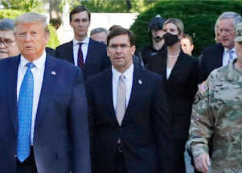

## Ex-Trump official: Trump wanted protesters shot

President Donald Trump wanted U.S. troops to shoot protesters during racial justice demonstrations in 2020, according to a new book.

[A similar tweet was flagged at the time »](https://www.yahoo.com/news/cant-you-just-shoot-them-former-defense-secretary-says-trump-wanted-violence-against-floyd-protesters-151957658.html)
