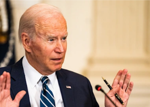

## 'Slap in the face': Taxpayers irked by canceled-debt idea

The president is mulling a plan to cancel student loan debt, which would then have to be paid by taxpayers — prompting some Americans to call out the policy as unfair.

[Would cost tens of billions of dollars »](https://www.yahoo.com/finance/news/student-loan-forgiveness-unfair-americans-162228849.html)
