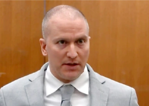

## Chauvin avoids life sentence after plea deal accepted

The judge overseeing the civil rights cases in the killing of George Floyd has accepted the terms of Derek Chauvin's plea agreement and will sentence him to 20 to 25 years in prison.

[Chauvin appealing state conviction »](https://www.yahoo.com/news/judge-overseeing-chauvin-civil-rights-165141774.html)
