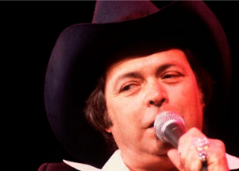

## Country music loses a star and 'Urban Cowboy' legend

Mickey Gilley — cousin of rock 'n' roll pioneer Jerry Lee Lewis — opened Gilley's, "the world's largest honky tonk," in Texas and it sparked the 1980 John Travolta movie.

[39 top-10 country hits and 17 No. 1 songs »](https://www.yahoo.com/entertainment/mickey-gilley-helped-inspire-urban-213116519.html)
