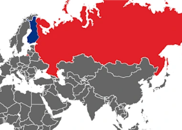

## Russia makes threats against another neighboring country

The Finnish prime minister and president released a joint statement announcing their support for Finland — which shares an 810-mile border with Russia — to join NATO.

[Russia threatens 'retaliatory steps' »](https://www.yahoo.com/news/finland-to-apply-to-nato-without-delay-as-russia-threatens-retaliatory-steps-133741633.html)
