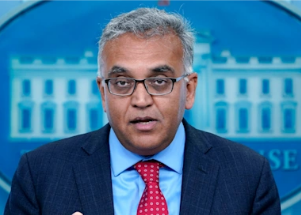

## White House COVID chief issues dire warning

Dr. Ashish Jha warns that the U.S. will be increasingly vulnerable to the virus this fall if Congress doesn't swiftly approve new funding for vaccines and treatments.

['The window is really closing on us' »](https://www.yahoo.com/news/ap-interview-us-vulnerable-covid-195842741.html)
