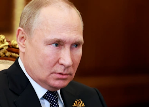

## Putin could be getting exactly what he feared most

Vladimir Putin considers NATO expansion as an existential threat. Now, his invasion of Ukraine seems to be bringing Russia's neighbors closer to the western military alliance.

[Putin warns of a 'mistake' »](https://www.yahoo.com/news/putin-nordic-nightmare-springing-life-145620414.html)
