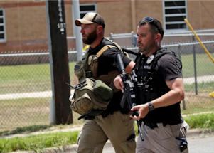

## When the Feds decided to ignore local police in Uvalde

Federal agents who went to Robb Elementary in Uvalde, Tex., on Tuesday to confront a gunman were told by local police to wait, but after about 30 minutes the agents took action.

[Order to wait a 'wrong decision' »](https://www.yahoo.com/news/feds-entered-uvalde-school-kill-230638123.html)
