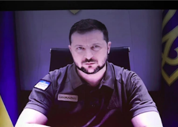

## Zelensky sounds alarm on impending 'catastrophe'

President Volodymyr Zelensky of Ukraine warned of a global hunger “catastrophe,” as he accused Russia of blocking exports of “our grain, barley, sunflower and more.”

[Ripple effect across the globe »](https://www.yahoo.com/news/zelensky-hunger-catastrophe-russia-ukraine-war-grain-exports-152203177.html)
