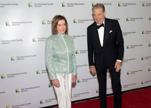

## More details emerge in DUI arrest of Pelosi's husband

The arrest of Paul Pelosi, the husband of Speaker of the House Nancy Pelosi, D-Calif., on suspicion of driving under the influence followed a collision in which another vehicle hit the Porsche he was driving.

[Driver of the other car not arrested »](https://www.yahoo.com/news/dui-arrest-pelosis-husband-came-160515580.html)
