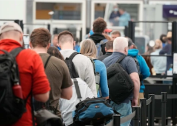

## 1 airline canceled over 800 flights this past weekend

U.S. airlines canceled more than 2,800 flights from Thursday through Monday, or about 2% of their schedules, according to the tracking service FlightAware.

['We expect a busy summer' »](https://www.yahoo.com/finance/news/canceled-flights-mar-first-weekend-153941563.html)
