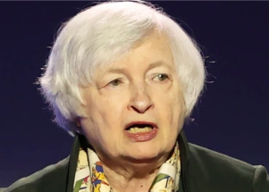

## 'I was wrong': Yellen admits she misread inflation threat

As the White House works to combat rising consumer prices, Treasury Secretary Janet Yellen acknowledged it was a mistake to downplay the threat of rising inflation.

[Last year she called it a 'small risk' »](https://www.yahoo.com/money/respect-fed-biden-vows-wont-184710018.html)
