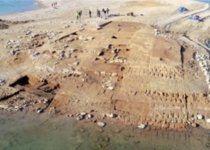

## After water level drops, 3,400-year-old city found

The ruins of an ancient city in Iraq — complete with a palace and a sprawling fort — were unearthed after extreme drought severely depleted water levels in Iraq's largest reservoir. 

[Key hub during the Mittani Empire »](https://www.yahoo.com/news/ancient-city-iraq-unearthed-extreme-180558360.html)
