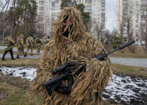

## Brutal anti-Russian strategy emerges in Ukraine

Ukrainian partisans claim that, in the past month, insurgents have attacked Russian trains and killed dozens of Russian soldiers, as well as supported their military's counterattacks.

[Bomb struck Kremlin-backed mayor »](https://www.yahoo.com/news/guerrilla-attacks-signal-rising-resistance-180947555.html)
