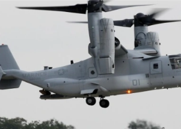

## Military aircraft crashes in California; 4 people dead

Naval Air Facility El Centro said that, contrary to early reports, there was no nuclear material on board the Marine Corps aircraft when it went down.

[In southeastern corner of the state »](https://www.yahoo.com/news/military-aircraft-crashes-imperial-county-211408736.html)
