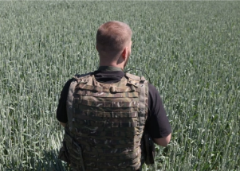

## Retired U.S. naval officer warns of food crisis

Russia’s blockade of ports on the Black Sea is preventing Ukrainian wheat exports, which could lead to catastrophic food shortages, Admiral James Stavridis says.

[The remedy he recommends  »](https://www.yahoo.com/finance/news/russia-ukraine-war-global-food-security-issues-165151840.html)
