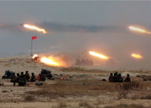

## Threatening move by Kim Jong Un reported by Seoul

Kim Jong Un's military reportedly fired suspected artillery pieces into the sea, days after the North Korean leader called for a stronger defense posture to counter threats.

[Kim prioritizes 'militant tasks' »](https://www.yahoo.com/news/seoul-north-korea-fires-suspected-145733826.html)
