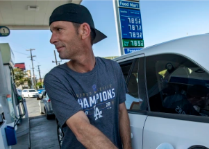

## What's driving oil and gas prices higher

There are four forces conspiring to drive prices higher. How much can consumers take? Researchers offer an assessment for the next several months.

[Rick Newman's column  »](https://www.yahoo.com/finance/news/why-theres-no-relief-in-sight-for-soaring-oil-and-gas-prices-195813517.html)
