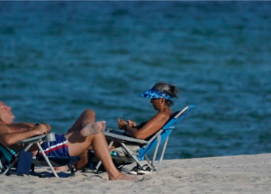

## More than 100M Americans warned to stay indoors

The heat wave, which set several records in the West, the Southwest and into Denver over the weekend, moved east into parts of the Gulf Coast and the Midwest on Monday.

['It’s going to be a hot summer' »](https://www.yahoo.com/news/excessive-heat-rolls-east-bakes-213740252.html)
