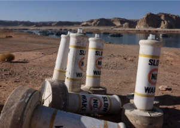

## Warning issued for Colorado River: 'Moment of reckoning'

The Colorado River's reservoirs have been drained so deeply that significant cuts to the water supply for seven Western states will be necessary in 2023, a federal official said.

['Unlike anything we have seen' »](https://www.yahoo.com/news/moment-of-reckoning-federal-official-warns-of-colorado-river-water-supply-cuts-171955277.html)
