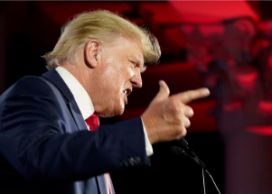

## Most in U.S. agree: Trump should be charged with crime

Nearly 6 in 10 Americans say former President Donald Trump should be charged with a crime for his role in the Jan.6 attack at the Capitol, a new ABC News/Ipsos poll finds.

[Trump lambastes hearings »](https://www.yahoo.com/gma/6-10-americans-trump-charged-130009380.html)
