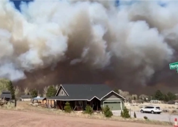

## 'The most threatening fire ... in the last 25 years'

Four buildings at the Kitt Peak National Observatory, southwest of Tucson, were lost in a wildfire, authorities said Saturday.

[Other buildings left intact »](https://www.yahoo.com/news/4-buildings-observatory-arizona-lost-203259207.html)
