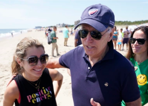

## Biden says he's considering federal gasoline tax holiday

President Biden said Monday that he's considering a federal holiday on the gas tax, possibly saving U.S. consumers as much as 18.4 cents a gallon.

[Decision likely by end of the week »](https://www.yahoo.com/news/biden-says-hes-considering-gasoline-162842534.html)
