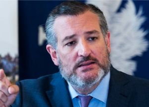

## Cruz's message to Garland after Roe is overturned

Sen. Ted Cruz, R-Texas, called for Attorney General Merrick Garland to "be on watch to stop any radicals threatening mob violence" after Friday's decision on abortion.

[What the senator also told Fox News »](https://www.yahoo.com/entertainment/ted-cruz-calls-ag-merrick-012312214.html)
