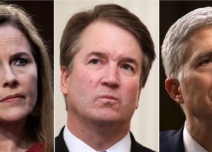

## Supreme Court takes aim at separation of church, state

The court has repeatedly ruled against officials whose policies and actions were taken to avoid violating the First Amendment prohibition on governmental endorsement of religion.

[Known as the 'establishment clause' »](https://www.yahoo.com/news/u-supreme-court-takes-aim-100830562.html)
