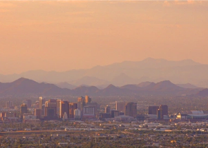

## America's hottest city faces climate change

During the summer in Phoenix, the average low is 84 degrees, and the city averages 111 days of triple-digit heat. For many residents, those conditions are catastrophic.

[Life and death in 'the zone' »](https://www.yahoo.com/news/can-phoenix-the-hottest-city-in-america-survive-a-changing-climate-090020499.html)
