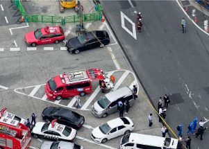

## Ex-Japanese PM Shinzo Abe shot in chest during speech

Japan’s former Prime Minister Shinzo Abe was reportedly in heart failure after he was shot at close range during a campaign speech Friday in western Japan, NHK TV said.

[Police arrested a male suspect at the scene »](https://www.yahoo.com/news/japan-ex-leader-abe-reportedly-031004756.html)
